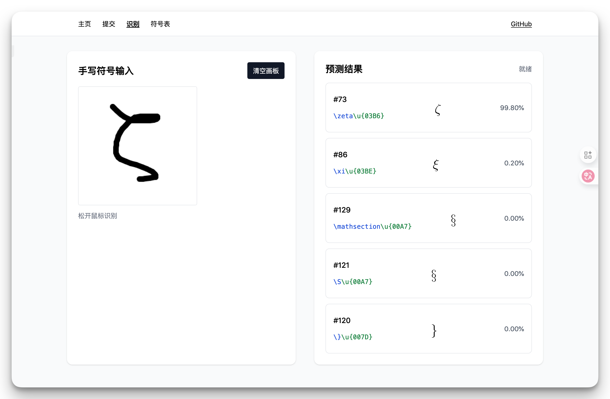
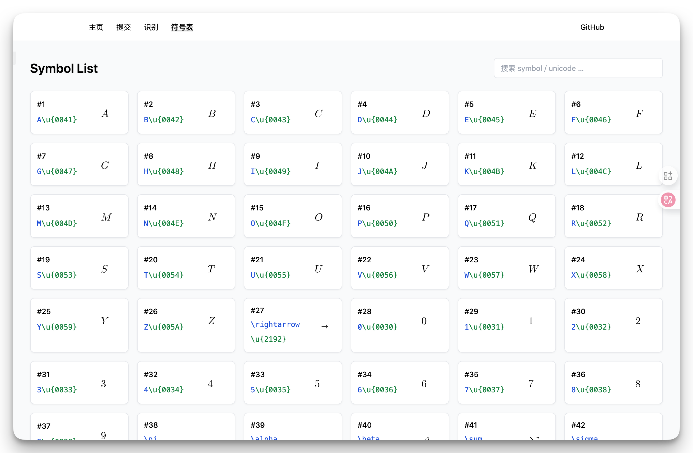
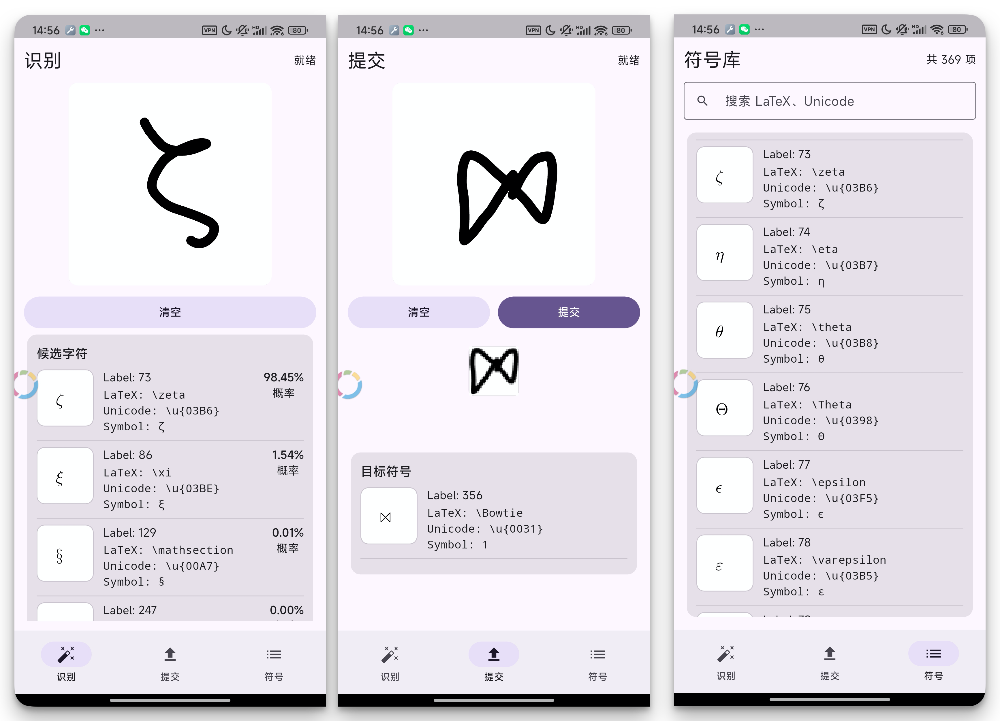
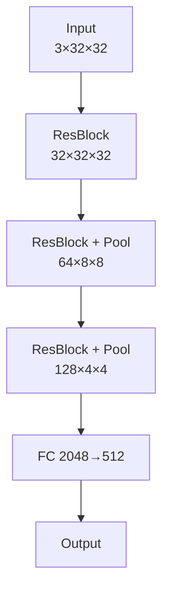

<div align="center">
<picture>
  <source
    srcset="./imgs/headline-logo-dark.svg"
    media="(prefers-color-scheme: dark)"
  />
  <source
    srcset="./imgs/headline-logo-light.svg"
    media="(prefers-color-scheme: light)"
  />
  
</picture>
</div>

# LaTeX Symbol Recognize

Symbolizer is a modern solution for handwritten LaTeX symbols recognition, including static websites and mobile apps. You can recognize your handwritten symbols on any devices.

The project is inspired by [Detexify](http://detexify.kirelabs.org/) and [Detypify](https://detypify.quarticcat.com/). However, Detexify uses [backend server](https://github.com/kirel/detexify-hs-backend) and requires network connection. Symbolizer uses WASM, allowing completely offline inference. Powered by ONNX runtime, the inference is extremely fast. Every recognition happens in milliseconds.

## Features

- [x] Offline inference
- [x] Tiny model ([ONNX](#download-onnx-model) 1.6MB)
- [x] Extremely fast recognition
- [x] Multiple platforms support, _draw_ on any devices
- [x] Recognize [396 symbols](https://symbolizer.melonhu.cn/symbols).

## Frontends

### Website

You can access to the Demo site at [https://symbolizer.melonhu.cn](https://symbolizer.melonhu.cn/infer) or [https://symbolizer.pages.dev](https://symbolizer.pages.dev/infer).





### Flutter apps

Symbolizer also provide Flutter apps, currently only support Android devices.



## Model

The model is a residual CNN with three basic residual blocks.

Main structure:



The training code can be found at [/train/](./train/).

Evaluation accuracy on test data:

| Cadidates | Accuracy |
| --------- | -------- |
| 1         | 0.849133 |
| 2         | 0.952136 |
| 3         | 0.974011 |
| 4         | 0.983318 |
| 5         | 0.987984 |

### Download ONNX model:

| Model                                                                                     | size  | Description                                        |
| ----------------------------------------------------------------------------------------- | ----- | -------------------------------------------------- |
| [residualcnn_int8.onnx](https://symbolizer.pages.dev/model/residualcnn_int8.onnx)         | 1.6MB | Trained from raw data. Residual structure.         |
| [residualcnn_augment_int8.onnx](https://symbolizer.pages.dev/model/residualcnn_int8.onnx) | 1.6MB | Trained from augmented data. Residual structure.   |
| [model_int8.onnx](https://symbolizer.pages.dev/model/model_int8.onnx)                     | 1.3MB | Trained from augmented data. Simple CNN structure, |

## Contribution

### Source Trees

| Dir                      | Description                            |
| ------------------------ | -------------------------------------- |
| [./mobile](./mobile)     | Flutter app code.                      |
| [./train](./train)       | Jupyter notebook for training.         |
| [./worker](./worker)     | Cloudflare worker source code.         |
| [./frontend](./frontend) | Website source code.                   |
| [./py_src](./py_src)     | Code for initial training, deprecated. |

### Build website

clone repo:

```bash
git clone https://github.com/zimya/symbolizer
```

To build the website, you need to install dependencies.

```bash
cd frontend
npm install
```

Then copy `*.wasm` file to `/public/ort`

```bash
cp node_modules/onnxruntime-web/dist/*.wasm public/ort/
```

Build and serve. You can access the website at `http://localhost:3000`.

```bash
npm run build
npx serve out
```

### Build mobile app

Mobile app requires Flutter and full Android toolchain (sdk=34).

Get dependencies and build:

```bash
cd mobile
flutter pub get
flutter build apk --release
flutter install
```

### Build workers

To build workers, you need to create a D1 database on [Cloudflare](https://dash.cloudflare.com/workers/d1).

Then copy the database UUID (`f7eb7945-6dae-41f4-a339-efac5327e882`, for example) and name to `wrangler.toml`.

Install wrangler:

```bash
cd worker
npm install
```

Create table structure for D1:

```bash
npx wrangler d1 execute symbolizer --file=./schema.sql
```

Deploy to Cloudflare:

```bash
npx wrangler deploy
```

Now you have your own database and workers domain. You can change `WORKER_BASE` in [./frontend/pages/submit.tsx](./frontend/pages/submit.tsx) or [./mobile/lib/pages/submit_page.dart](./mobile/lib/pages/submit_page.dart) to your own domain if you like.

### Contribute to the data

If you found any mistakes in symbol recognition, you can visit [submit page](https://symbolizer.pages.dev/submit) and contribute your handwritings. This will help us improve our model, thanks for the contribution!

## Thanks

- https://detexify.kirelabs.org/classify.html for initial inspiration.
- https://detypify.quarticcat.com for website and model design.
- https://ar5iv.labs.arxiv.org/html/1701.08380 The training dataset.
